# Setting Up Snowplow on AWS
Snowplow is a powerful and flexible event data collection and analytics platform. When set up on AWS (Amazon Web Services), Snowplow enables organizations to capture, track, and analyze various types of data from different sources in real-time. By implementing Snowplow on AWS, businesses can gain valuable insights into user behavior, customer interactions, and system performance, allowing them to make data-driven decisions and optimize their operations effectively. This guide will walk you through the process of setting up Snowplow on AWS, ensuring you have a solid foundation for collecting and analyzing event data.
## Objective
- Create an AWS Account.
- Set up infrastructure to host Snowplow on AWS.
- Install Snowplow trackers to collect event data.
- Deploy a Snowplow Collector to receive and process event data.
- Configure Snowplow enrichment for additional data insights.
- Choose a data storage solution for storing and querying Snowplow data.
- Enable data visualization and analysis using visualization tools or analytics platforms.
- Monitor and maintain the Snowplow setup for data accuracy and system performance.

## Environment and Resources Required
Below Github repository contains configurations, schemas, sample web app and everything needed for setting up a Snowplow real-time analytics pipeline in AWS.

**1.Github UR**:  [Click here](https://github.com/fabriq-labs/fabriq-platform/tree/master/snowplow/aws) - fabriq-platform-snowplow-aws

**2.Cloud Provider**:  The Snowplow Enricher is deployed on AWS (Amazon Web Services), a reliable and scalable cloud platform known for its vast array of services.

**3.ECS (Elastic Container Service)**: The Snowplow Enricher is running on ECS, a fully managed container orchestration service, allowing for easy deployment and scaling of containerized applications.

**4.EC2 (Elastic Compute Cloud)**:  The Snowplow Enricher uses EC2 instances, which provide virtual compute resources, ensuring flexibility and control over the computing environment.

**5.S3**: (5 buckets)
- snowplow-good-events-fabriq (Not Public)
- snowplow-bad-events-fabriq (Not Public)
- snowplow-good-events-enriched-fabriq (Not Public)
- snowplow-bad-events-enriched-fabriq (Not Public)
- fabriq-snowplow-enricher (store enricher files)

**6.Kineses Data Stream**: (4 Data Streams)
- snowplow-collected-bad-events-stream
- snowplow-collected-good-events-stream
- snowplow-enriched-bad-events-stream
- snowplow-enriched-good-events-stream

**7.Kineses Firehose Delivery Stream**: (4 Delivery Streams)
- snowplow-collected-bad-events-firehose
    (Source: snowplow-collected-bad-events-stream, Kinesis Data Stream | Destination: snowplow-bad-events-fabriq, S3 Bucket)
- snowplow-collected-good-events-firehose
    (Source: snowplow-collected-good-events-stream, Kinesis Data Stream | Destination: snowplow-good-events-fabriq, S3 Bucket)
- snowplow-enriched-bad-events-firehose
    (Source: snowplow-enriched-bad-events-stream, Kinesis Data Stream | Destination: snowplow-bad-events-enriched-fabriq, S3 Bucket)
- snowplow-enriched-good-events-firehose
    (Source: snowplow-enriched-good-events-stream, Kinesis Data Stream | Destination: snowplow-good-events-enriched-fabriq, S3 Bucket)

# Steps to setup the Snowplow Streams
AWS Snowplow Architecture


This image is obtained from the following [blog](https://aswinkumar4018.medium.com/setup-snowplow-real-time-analytics-pipeline-dc8a71cd14f6).


## Create a Kinesis Data Streams for Snowplow Collector Output

- Create `snowplow-collected-bad-events-stream` kinesis data stream for collecting bad events from Snowplow Collector.
  (Events that are too big (w.r.t 1MB Kinesis limit) to be collected will be stored in this bad stream as errors)
- Create `snowplow-collected-good-events-stream` kinesis data stream for collecting good events from Snowplow Collector.

- Goto the console [Click here](https://us-east-1.console.aws.amazon.com/kinesis/home)

- Click to Create Data stream

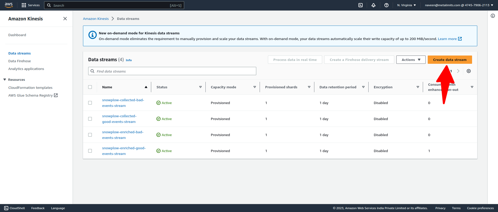
- Enter Data stream name and Setup a Configuration then click to create data stream

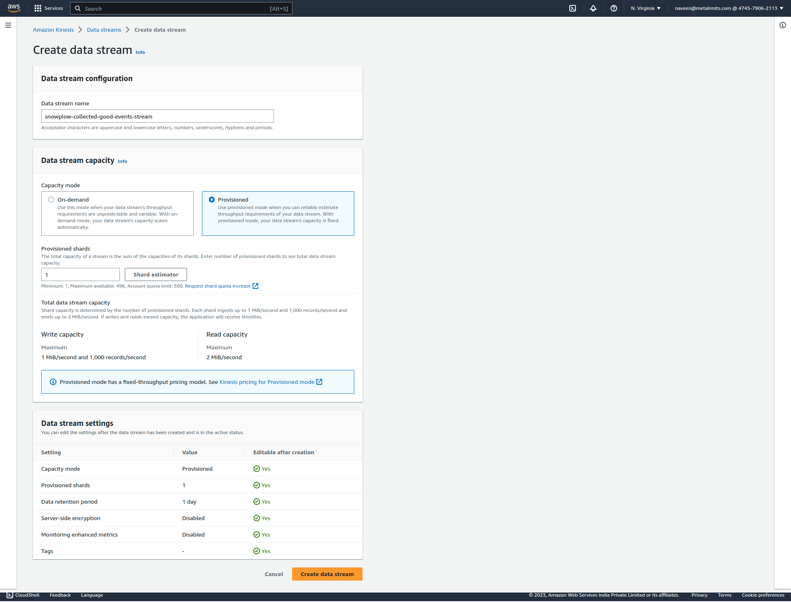

- Go to the S3 console and create the necessary buckets.

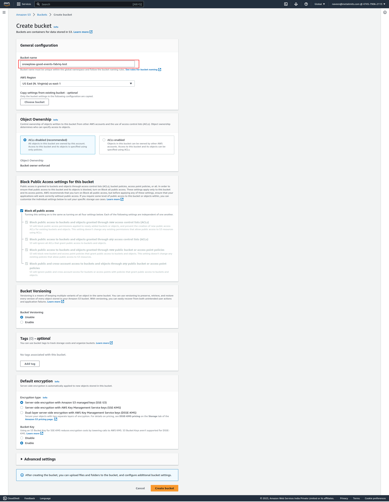

- Once the required S3 buckets are created, proceed to set up a Data Firehose.

- Click on "Create Delivery Stream" and select the data stream source as `snowplow-collected-good-events-stream` and the destination S3 bucket as `snowplow-good-events-fabriq`. Finally, create the Data Firehose.

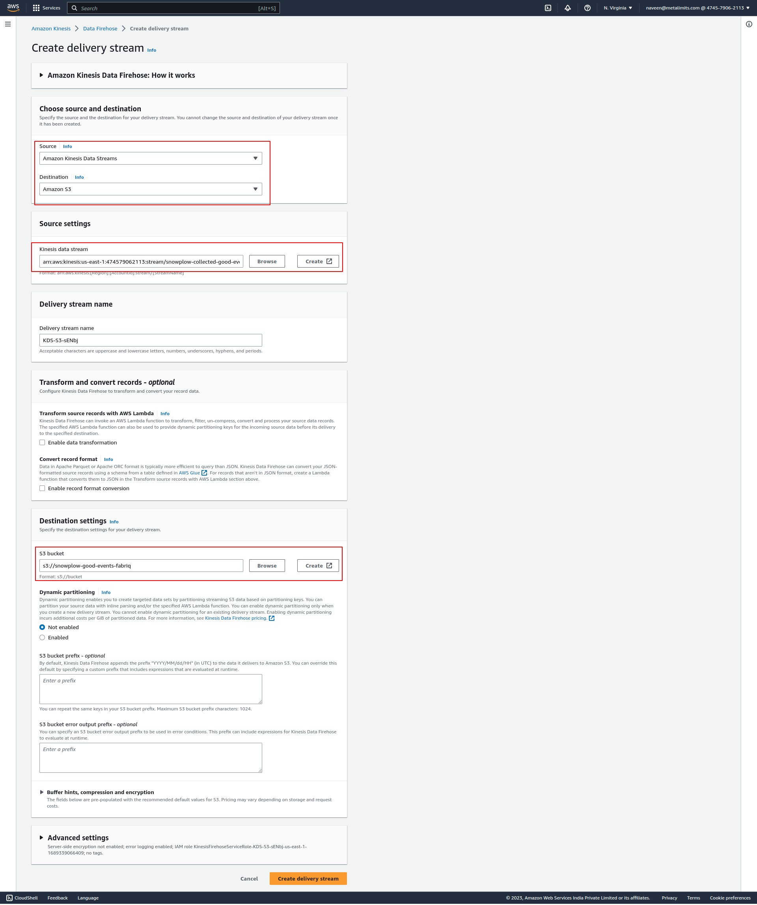

## Setup Snowplow Collector Instance (Scala Stream Collector)

Github URL:  [Click here](https://github.com/fabriq-labs/fabriq-platform/tree/master/snowplow/aws) - fabriq-platform-snowplow-aws.

You can find the `config.hocon` file under the `fabriq-platform-snowplow-aws-collector` folder.

To set up the good and bad event streams, you can use the following configuration in the `config.hocon` file:

```markdown
good = "snowplow-collected-good-events-stream"
bad = "snowplow-collected-bad-events-stream"
```

Additionally, you can configure the AWS credentials under the sink as follows:

```markdown
aws {
    accessKey = "your aws accessKey here"
    secretKey = "your aws secretKey here"
}
```
After configuring the `config.hocon` file and setting up the desired streams and AWS credentials, you can proceed to build it into a Docker ./aws/image and push it to the Amazon Elastic Container Registry (ECR).

### Set up a task definition

- Click the "Create new Task Definition" button. Select the launch type compatibility that matches your requirements (EC2 or Fargate)
- Fill in the mandatory fields and proceed to the next step.

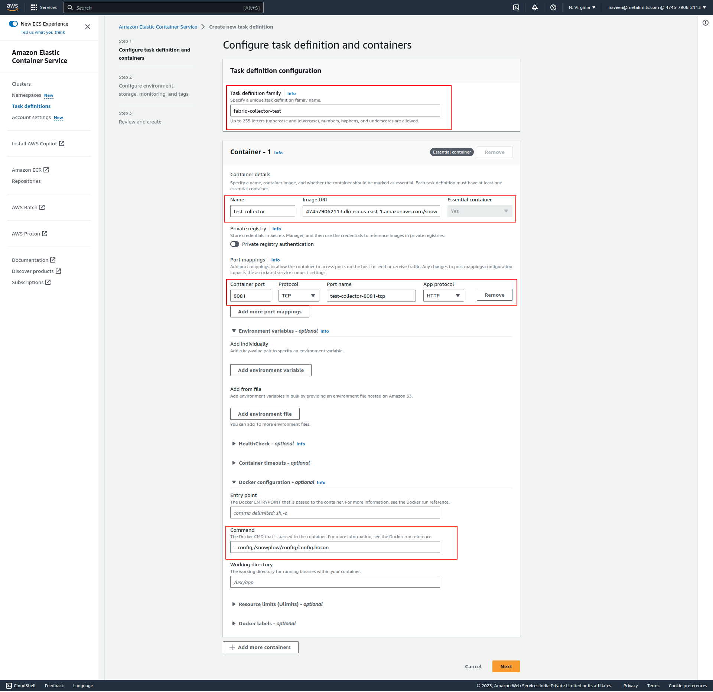

- Once all the configurations are done, save the settings.

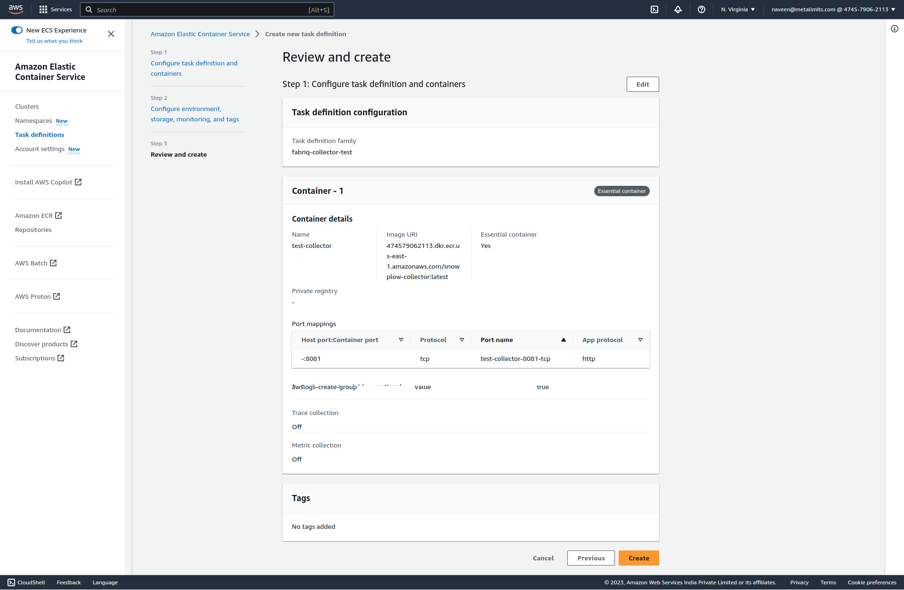

### Set up a Cluster
- Create a cluster.

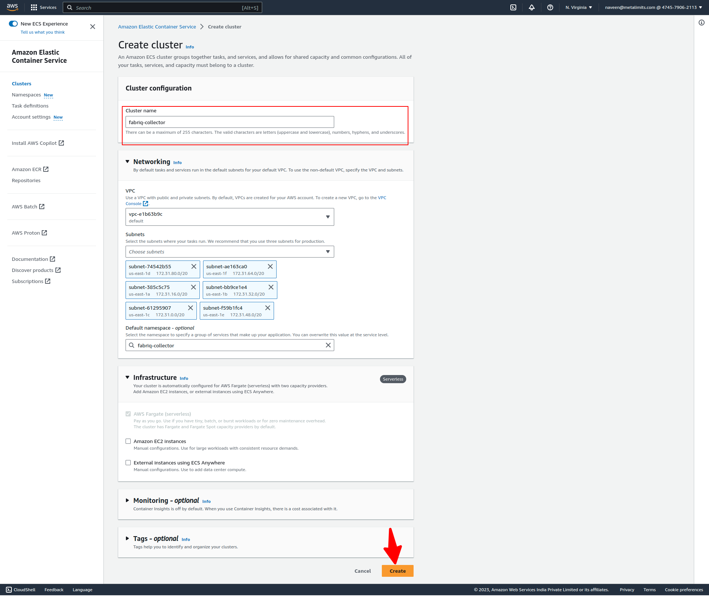

### Set up a Service
- Once the cluster is created, the next step is to create a service.

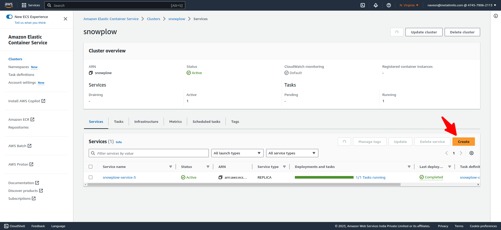

- Select a compute option in the environment.
- In the deployment configuration, choose the application type as "service" and select the previously created task definition. Depending on your requirements, you can create the desired number of tasks.
- If you require a load balancer, configure it and create a service. Please note that it may take some time for the deployment to complete.

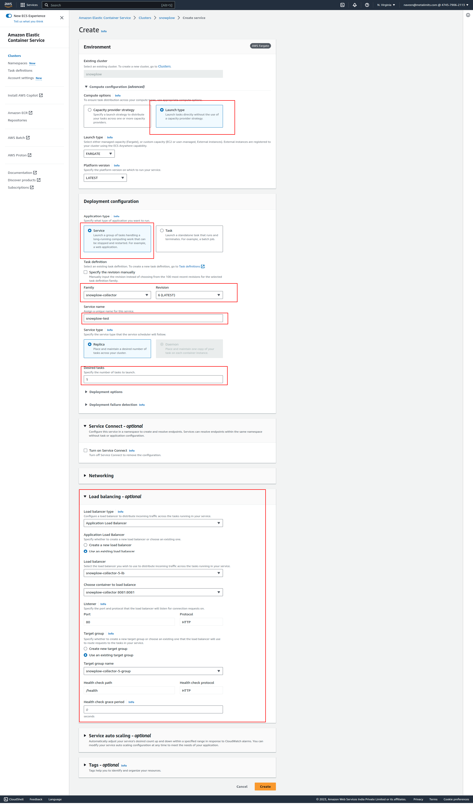

- once deployed you can select the service and got to the networking tab you can find out the DNS names
- To check if the application is running successfully, open the address and update the URL with "/health". If the response is "OK", it indicates that the app is running successfully.

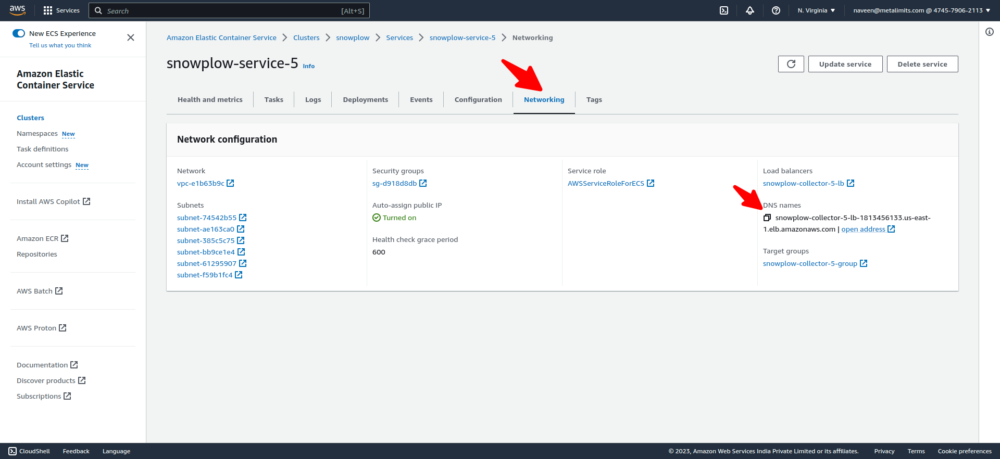

## Setting Up Snowplow Enricher and Loader on EC2 Instance

To set up Snowplow Enricher and Loader on an EC2 instance, follow these steps:

- Launch an EC2 instance with the desired specifications and operating system.

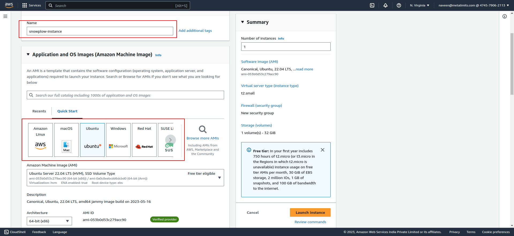

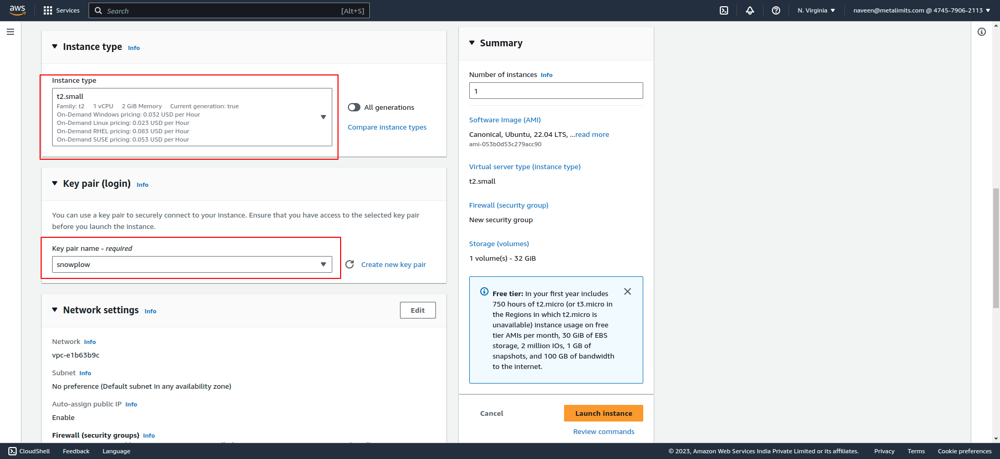

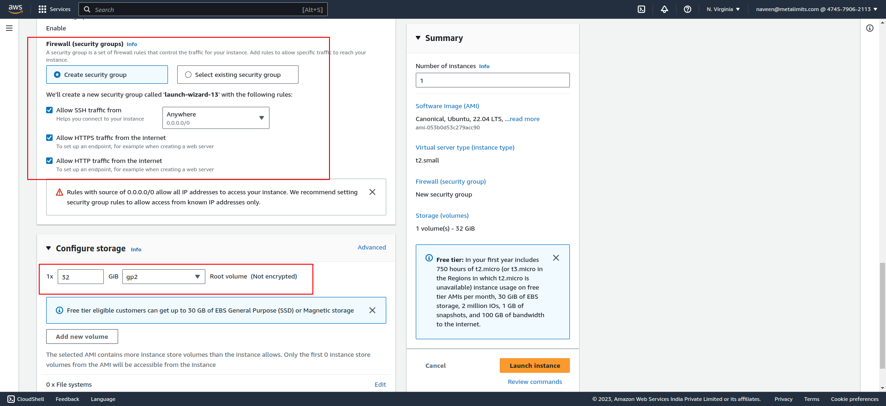

- SSH into the EC2 instance using a secure terminal.
- Install Docker and Docker Compose on your machine if you haven't already.
- To obtain the configuration files, you can clone the repository located at [Click here](https://github.com/fabriq-labs/fabriq-platform/tree/master/snowplow/aws). This repository contains the necessary files for setting up Snowplow on AWS. 

### Configuring the Enricher
- Once you have cloned the repository, upload your enrichments to the `enrichments` folder inside the enricher directory.

- After uploading the enrichments, you can use the following configuration in your `config.hocon` file to reference them:

```{
  "input": {
    "streamName": "snowplow-collected-good-events-stream"
  }

  "output": {
    "good": {
      "streamName": "snowplow-enriched-good-events-stream"
    }

    "bad": {
      "streamName": "snowplow-enriched-bad-events-stream"
    }
  }
}
```


### Configuring the Loader

- You can find the loader configurations under the "loader" folder in the repository.
- To update the database details, modify the `config.hocon` file with the appropriate database settings.
- Here is a sample configuration with valid stream name and database details:
```
{
  "input": {
    "type": "Kinesis",
    "streamName": "snowplow-enriched-good-events-stream",
    "region": "us-east-1"
  },
  "output" : {
    "good": {
      "type": "Postgres",
      "host": "localhost",
      "database": "content_analytics_db",
      "username": "Postgres",
      "password": "Postgres",
      "schema": "atomic",
      "port": 5432
    }
  }
}
```
- In the configuration above, make sure to provide the appropriate values for the `streamName` representing the Kinesis stream name and the database details such as   `host, database, username, password, schema, and port` for the Postgres database. This configuration specifies that the Snowplow enriched good events will be consumed from the Kinesis stream and loaded into the specified Postgres database.

### Configuring the Docker Compose

- To set up Snowplow Enricher and Loader using Docker Compose, create a docker-compose.yml file with the following sample code:

```version: "3"
services:
  enricher:
    ./aws/image: snowplow/snowplow-enrich-kinesis:3.8.0
    command:
      [
        "--config",
        "/snowplow/config/config.hocon",
        "--iglu-config",
        "/snowplow/config/resolver.json",
        "--enrichments",
        "/snowplow/config/enrichments"
      ]
    volumes:
      - ./enricher:/snowplow/
    environment:
      - "AWS_ACCESS_KEY_ID=${AWS_ACCESS_KEY_ID}"
      - "AWS_SECRET_ACCESS_KEY=${AWS_SECRET_ACCESS_KEY}"
  loader:
    ./aws/image: snowplow/snowplow-postgres-loader:0.3.3
    command:
      [
        "--config",
        "/snowplow/config/config.hocon",
        "--resolver",
        "/snowplow/config/resolver.json"
      ]
    depends_on:
      - enricher
    volumes:
      - ./loader:/snowplow/
    environment:
      - "AWS_ACCESS_KEY_ID=${AWS_ACCESS_KEY_ID}"
      - "AWS_SECRET_ACCESS_KEY=${AWS_SECRET_ACCESS_KEY}" 
```
      
 This `docker-compose.yml` file defines two services: `enricher` and `loader`. The `enricher` service uses the `snowplow/snowplow-enrich-kinesis:3.8.0` image, while the `loader` service uses the `snowplow/snowplow-postgres-loader:0.3.3` ./aws/image. The services are configured with necessary command-line arguments, volumes for mounting local directories, and environment variables for AWS access credentials.

You can customize the configuration by adjusting the paths and environment variables as per your specific requirements. Once you have created the `docker-compose.yml` file, you can use it to deploy and manage the Snowplow Enricher and Loader services using Docker Compose.

## Deploying the Snowplow Application
To manage your Docker Compose services, you can use the following commands:

1. To start the services defined in your `docker-compose.yml` file and detach the terminal (run in the background), use the command: `docker-compose up -d`
```bash
docker-compose up -d
```

2. To stop and remove the running services defined in your `docker-compose.yml` file, use the command: `docker-compose down`

```bash
docker-compose down
```
These commands allow you to easily manage the lifecycle of your Docker Compose services, starting them in detached mode for continuous operation or stopping and removing them when they are no longer needed.

```bash
docker ps
```

The `docker ps` command is used to display the currently running containers. It provides information such as the container ID, ./aws/image, status, ports, and names of the running containers. By running `docker ps`, you can see a list of the active containers on your Docker host.

To view the logs of a specific container, you can use the `docker logs` command followed by the container name or ID. Here's an example:

```bash
docker logs <container_name_or_id>
```

Replace `<container_name_or_id>` with the actual name or ID of the container whose logs you want to view.

By running this command, you can access the logs generated by the specified container, helping you troubleshoot issues or monitor the application's output.