# Setting Up Snowplow on GCP
Setting up Snowplow on Google Cloud Platform (GCP) involves configuring and installing the Snowplow event data collection platform on GCP infrastructure. Snowplow is an open-source tool used for collecting, processing, and analyzing event data from various sources.

To set up Snowplow on GCP, you need to create a GCP account and project, enable necessary GCP services like Google Cloud Storage, BigQuery and Pub/Sub, provision the required infrastructure, install Snowplow components (Collector, Enrichment, Loader), configure data storage, and set up monitoring and logging.

Once Snowplow is running, it collects event data, which can be stored in GCP's storage systems like Google Cloud Storage or BigQuery. You can then utilize GCP's data analysis and visualization tools to analyze and visualize the collected event data.

Setting up Snowplow on GCP involves a series of steps to ensure a successful installation and configuration process, allowing you to effectively collect and utilize event data for analysis and insights.
## Objective

1. Create a Google Cloud Platform (GCP) Account.
   - Sign up for a GCP account to access GCP services and resources.

2. Set up a GCP Project.
   - Create a new GCP project to organize and manage resources for Snowplow.

3. Enable Google Cloud Pub/Sub.
   - Enable the Google Cloud Pub/Sub service in GCP to facilitate event data ingestion and streaming.

4. Provision infrastructure for Snowplow.
   - Set up virtual machines or utilize managed services like Google Kubernetes Engine (GKE) to provide the necessary computing resources for Snowplow components.

5. Install and configure Snowplow trackers.
   - Implement Snowplow trackers in your applications or websites to collect event data and send it to the Snowplow infrastructure.

6. Deploy a Snowplow Collector using Pub/Sub.
   - Set up the Snowplow Collector component to subscribe to the Pub/Sub topic and receive and process the incoming events.

7. Configure Snowplow enrichment for enhanced insights.
   - Set up Snowplow's Enrichment component to enrich the incoming events with additional contextual information, such as user demographics or geolocation data.

8. Choose a data storage solution.
   - Select and configure a suitable data storage solution in GCP, such as Google Cloud Storage or Google BigQuery, to store and query the Snowplow event data.

9. Enable data visualization and analysis.
   - Utilize data visualization tools or analytics platforms available in GCP, such as Google Data Studio or BigQuery, to analyze and visualize the Snowplow event data.

10. Set up monitoring and maintenance.
    - Implement monitoring and logging mechanisms to track the health, data accuracy, and performance of the Snowplow setup on GCP. Ensure proactive monitoring and maintenance for optimal system performance.

These objectives provide a roadmap for setting up Snowplow with Google Cloud Pub/Sub on GCP, covering various aspects from account creation to monitoring and maintenance. Adjust the objectives according to your specific requirements and use case.

## Environment and Resources Required
Below Github repository contains configurations, schemas, sample web app and everything needed for setting up a Snowplow real-time analytics pipeline in GCP.

Github URL:  [Click here](https://github.com/fabriq-labs/fabriq-platform/tree/master/snowplow/gcp) - fabriq-platform-snowplow-gcp

Cloud:  GCP

VM instances: Snowplow Collector — e2-medium

VM instances: Snowplow Enricher — e2-medium

Setup a BigQuery

Setup a Service Account

Cloud Storage
- fabriq-dp-enricher
- snowplow-events-collector-fabriq

Pub/Sub
- snowplow-good-events-fabriq
- snowplow-bad-events-fabriq
- snowplow-good-events-enriched-fabriq
- snowplow-bad-events-enriched-fabriq

**For bigquery**
- snowplow-bad-events-bq-loader-fabriq
- snowplow-types-events-bq-loader-fabriq
- snowplow-failed-inserts-topic-events-bq-loader-fabriq

# Steps to setup the Snowplow Streams
GCP Snowplow Architecture

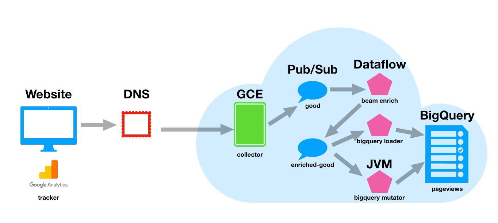

This image is obtained from the following [blog](https://www.simoahava.com/analytics/install-snowplow-on-the-google-cloud-platform/).


**Document Links for setup Snowplow**

- [Setup Collector](https://docs.snowplow.io/docs/pipeline-components-and-applications/stream-collector/setup/)
- [Setup Enricher](https://docs.snowplow.io/docs/pipeline-components-and-applications/enrichment-components/enrich-pubsub/)
- [Setup Loader](https://docs.snowplow.io/docs/pipeline-components-and-applications/stream-collector/setup/)
- [Setup Mutator, Repeater](https://docs.snowplow.io/docs/destinations/warehouses-and-lakes/bigquery/#streamloader)

### Create a Google Cloud Project: 
- If you haven't already, create a Google Cloud project that will be used for your Snowplow data, Postgres, and BigQuery setup.

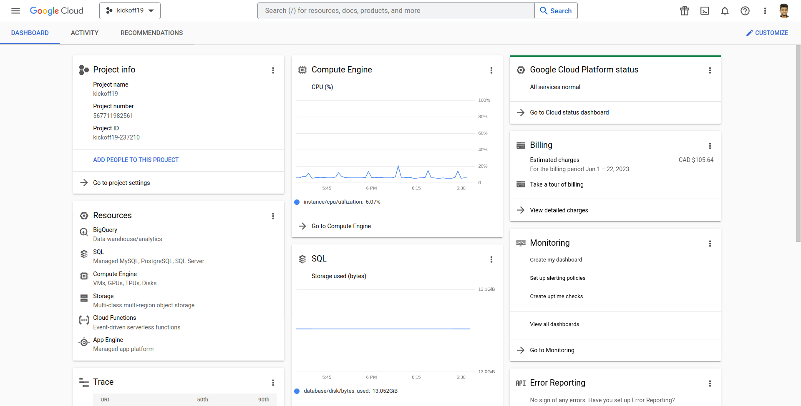

### Setup a Service Account
- Goto the console [Click here]( https://console.cloud.google.com/apis/credentials)
- To create credentials, first select the Compute Engine default service account, and then assign roles to it. Finally, create a new service account.

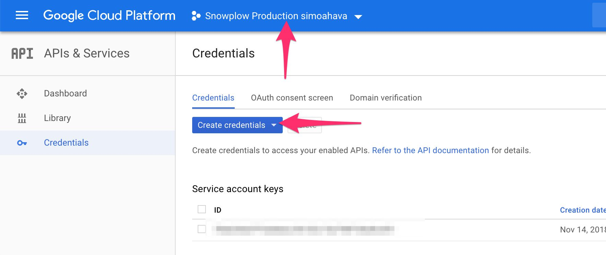

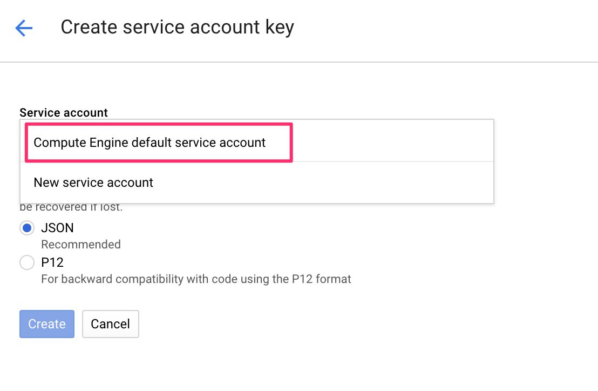

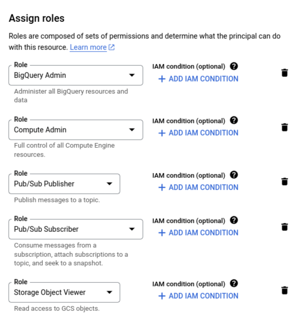

## Create a Pub/Sub Topics for Snowplow Collector, Enricher and Loader

- Create `snowplow-bad-events-fabriq` Pub/Sub Topic for collecting bad events from Snowplow Collector.
- Create `snowplow-good-events-fabriq` Pub/Sub Topic for collecting good events from Snowplow Collector.

- Goto the console [Click here](https://console.cloud.google.com/cloudpubsub/topic/list)

- Click to Create Topic

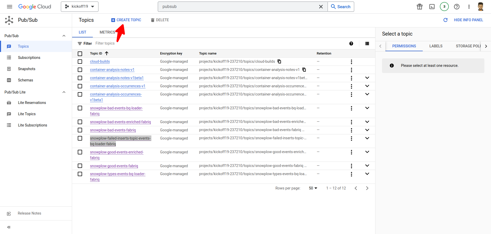

- Enter Topic ID and create a Topic

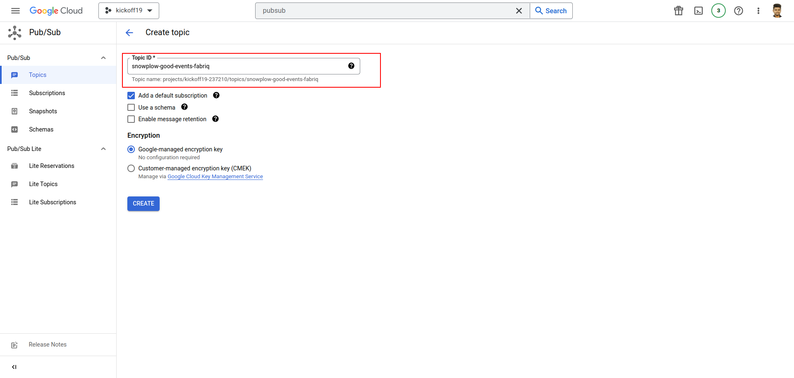

- Once the topic is created, you can obtain the subscription.

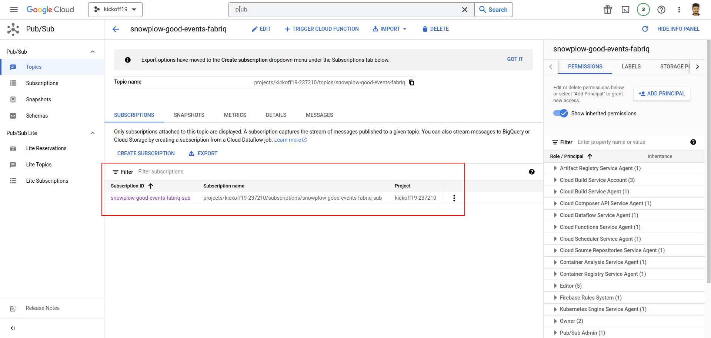

- Go to the Cloud Storage and create the necessary buckets.

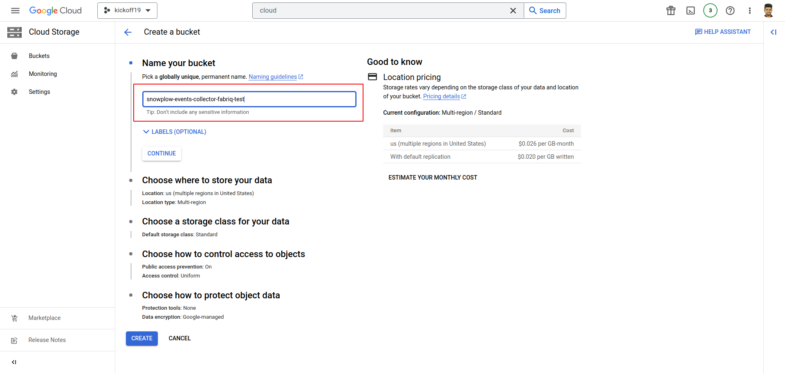

- Once the check the required Cloud Storage buckets are created.

## Setup Snowplow Collector Instance (Scala Stream Collector)

Github URL:  [Click here](https://github.com/fabriq-labs/fabriq-platform/tree/master/snowplow/gcp) - fabriq-platform-snowplow-gcp.

You can find the `config.hocon` file [here.](https://github.com/fabriq-labs/fabriq-platform/blob/master/snowplow/gcp/snowplow/collector/configs/config.hocon)

To set up the good and bad event topics, you can use the following configuration in the `config.hocon` file:

```markdown
good = "snowplow-good-events-fabriq"
bad = "snowplow-bad-events-fabriq"
```

Additionally, you can configure the GCP credentials under the sink as follows:

```markdown
googleProjectId = "your project id here"
```
After configuring the `config.hocon` file and setting up the desired topics and GCP credentials, you can proceed to build it into a Docker image and push it to the Google Container Registry (gcr).

## Creating a VM instance for the collector, loader, and enricher.

- To set up the data processing pipeline, create a separate instance for the collector and another instance for the loader and enricher components.
- For both the collector and loader/enricher instances, use the same configurations.

To create an instance, you need to:
1. Select a suitable boot disk.
2. Enter a unique instance name.
3. Choose the appropriate machine type for your workload.
4. Ensure that firewall rules allow the necessary network access for the instance.

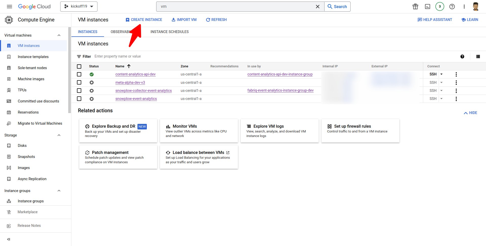

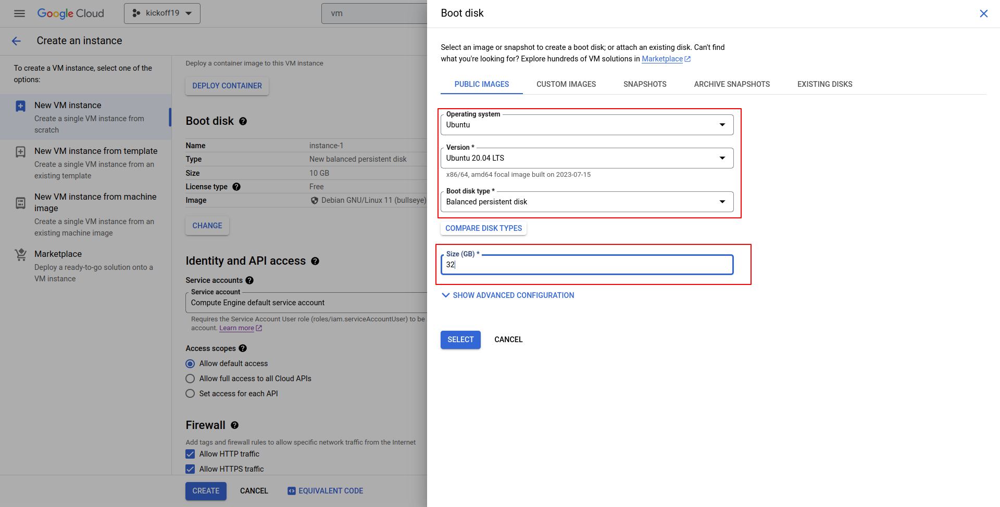

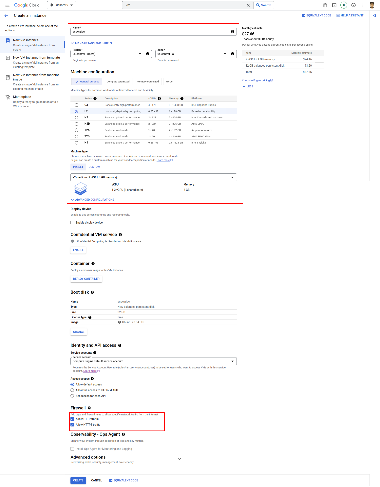

- Once the collector instance is created, you can allow firewall access on port 8081 specifically for that instance.
- SSH into the VM instance using a secure terminal.
- Install Docker and Docker Compose on your machine if you haven't already.
- To obtain the configuration files, you can clone the repository located at [Click here](https://github.com/fabriq-labs/fabriq-platform/tree/master/snowplow/gcp). This repository contains the necessary files for setting up Snowplow on GCP. 

### Configuring the Enricher
- Once you have cloned the repository, upload your enrichments to the `enrichments` folder inside the enricher directory.

- After uploading the enrichments, you can use the following configuration in your `config.hocon` file to reference them:

```{
  "input": {
    "subscription": "projects/your-projectid/subscriptions/snowplow-good-events-fabriq-sub"
  }

  "output": {
    "good": {
      "topic": "projects/your-projectid/topics/snowplow-good-events-enriched-fabriq"
    }

    "bad": {
      "topic": "projects/your-projectid/topics/snowplow-bad-events-enriched-fabriq"
    }
  }
}
```


### Configuring the Loader

- You can find the loader configurations under the "loader" folder in the repository.
- To update the database details, modify the `config.hocon` file with the appropriate database settings.
- Here is a sample configuration with valid Topics and database details:
1. Loader Config for Postgres
```
{
  "input": {
    "type": "PubSub"
    "projectId": "your project id"
    "subscriptionId": "snowplow-good-events-enriched-fabriq-sub"
  }
  "output" : {
    "good": {
      "type": "Postgres",
      "host": "localhost",
      "database": "content_analytics_db",
      "username": "Postgres",
      "password": "Postgres",
      "schema": "atomic",
      "port": 5432
    }
  }
}
```
- In the configuration above, make sure to provide the appropriate values for the `projectId` and `subscriptionId` to representing the Topicsand the database details such as   `host, database, username, password, schema, and port` for the Postgres database. This configuration specifies that the Snowplow enriched good events will be consumed from the Kinesis stream and loaded into the specified Postgres database.
2. Loader Config for BigQuery

- Kindly provide a unique project ID, dataset ID, and table ID for proper configuration and execution.
```
{
  "projectId": "your project id"

  "loader": {
    "input": {
      "subscription": "snowplow-good-events-enriched-fabriq-sub"
    }

    "output": {
      "good": {
        "datasetId": "atomic"
        "tableId": "events"
      }

      "bad": {
        "topic": "snowplow-bad-events-bq-loader-fabriq"
      }

      "types": {
        "topic": "snowplow-types-events-bq-loader-fabriq"
      }

      "failedInserts": {
        "topic": "snowplow-failed-inserts-topic-events-bq-loader-fabriq"
      }
    }
  }

  "mutator": {
    "input": {
      "subscription": "snowplow-types-events-bq-loader-fabriq-sub"
    }

    "output": {
      "good": ${loader.output.good} # will be automatically inferred
    }
  }

  "repeater": {
    "input": {
      "subscription": "snowplow-failed-inserts-topic-events-bq-loader-fabriq-sub"
    }

    "output": {
      "good": ${loader.output.good} # will be automatically inferred

      "deadLetters": {
        "bucket": "gs://snowplow-events-collector-fabriq"
      }
    }
  }

  "monitoring": {} # disabled
}
```
The configuration includes the following components: loader, mutator, repeater, and monitoring. The loader component processes input from a subscription, stores good events in a specified dataset and table, and sends bad events and event types to their respective topics. The mutator component takes input from a subscription and outputs good events using the loader's output configuration. The repeater component processes failed inserts from a subscription, stores good events using the loader's output, and stores dead letters in a designated bucket. Monitoring for the pipeline is disabled.

Here are the main components and their respective purposes in the provided configuration:

1. loader:
   - Input: Processes events from the "snowplow-good-events-enriched-fabriq-sub" subscription.
   - Output (good events): Stores them in the "atomic" dataset and "events" table.
   - Output (bad events): Sends them to the "snowplow-bad-events-bq-loader-fabriq" topic.
   - Output (event types): Sends them to the "snowplow-types-events-bq-loader-fabriq" topic.
   - Output (failed inserts): Sends them to the "snowplow-failed-inserts-topic-events-bq-loader-fabriq" topic.

2. mutator:
   - Input: Processes events from the "snowplow-types-events-bq-loader-fabriq-sub" subscription.
   - Output (good events): Automatically inferred from the loader's output configuration.

3. repeater:
   - Input: Processes failed inserts from the "snowplow-failed-inserts-topic-events-bq-loader-fabriq-sub" subscription.
   - Output (good events): Automatically inferred from the loader's output configuration.
   - Output (dead letters): Stores them in the "gs://snowplow-events-collector-fabriq" bucket.

4. monitoring: Disabled, indicating that no specific monitoring configuration is provided.

These components work together to process and distribute events based on their types, store them in designated locations, and handle any failed inserts or errors in the pipeline.

### Configuring the Docker Compose

- To load your service account key JSON file under the snowplow repository, set the environment variable `GOOGLE_APPLICATION_CREDENTIALS to "/snowplow/service-account-key.json"`.
- To set up Snowplow Collector using Docker Compose, create a docker-compose.yml file with the following sample code:
```
version: '3'
services:
    snowplow-collector:
    image: snowplow/scala-stream-collector-pubsub:2.9.0
    command: [ "--config", "/snowplow/collector/configs/config.hocon" ]
    volumes:
      - ./snowplow/:/snowplow/
    ports:
      - "8080:8080"
    environment:
      - "GOOGLE_APPLICATION_CREDENTIALS=/snowplow/service-account-key.json"
```
- To set up Snowplow Enricher and Loader using Docker Compose, create a docker-compose.yml file with the following sample code:
```version: '3'
services:
  snowplow-enricher:
    image: snowplow/snowplow-enrich-pubsub:3.8.0
    command:
      [
        "--config",
        "/snowplow/enricher/configs/config.hocon",
        "--iglu-config",
        "/snowplow/enricher/configs/resolver.json",
        "--enrichments",
        "/snowplow/enricher/configs/enrichments"
      ]
    volumes:
      - ./snowplow:/snowplow/
    environment:
      - "GOOGLE_APPLICATION_CREDENTIALS=/snowplow/service-account-key.json"
  snowplow-loader:
    image: snowplow/snowplow-bigquery-streamloader:1.6.4
    volumes:
      - ./snowplow:/snowplow/
    command:
      - "--config=/snowplow/loader/configs/config.hocon"
      - "--resolver=/snowplow/loader/configs/resolver.json"
    environment:
      - "GOOGLE_APPLICATION_CREDENTIALS=/snowplow/service-account-key.json"
  snowplow-loader-pg:
    image: snowplow/snowplow-postgres-loader:0.3.3
    volumes:
      - ./snowplow:/snowplow/
    command:
      - "--config=/snowplow/loader-pg/configs/config.hocon"
      - "--resolver=/snowplow/loader-pg/configs/resolver.json"
    environment:
      - "GOOGLE_APPLICATION_CREDENTIALS=/snowplow/service-account-key.json"
  snowplow-repeater:
    image: snowplow/snowplow-bigquery-repeater:1.6.4
    volumes:
      - ./snowplow:/snowplow/
    command:
      - "--config=/snowplow/loader/configs/config.hocon"
      - "--resolver=/snowplow/loader/configs/resolver.json"
      - "--bufferSize=20"
      - "--timeout=20"
      - "--backoffPeriod=900"
    environment:
      - "GOOGLE_APPLICATION_CREDENTIALS=/snowplow/service-account-key.json"
  snowplow-mutator:
    image: snowplow/snowplow-bigquery-mutator:1.6.4
    volumes:
      - ./snowplow:/snowplow/
    command:
      - "listen"
      - "--config=/snowplow/loader/configs/config.hocon"
      - "--resolver=/snowplow/loader/configs/resolver.json"
    environment:
      - "GOOGLE_APPLICATION_CREDENTIALS=/snowplow/service-account-key.json"
  snowplow-mutator-create:
    image: snowplow/snowplow-bigquery-mutator:1.6.4
    volumes:
      - ./snowplow:/snowplow/
    command:
      - "create"
      - "--config=/snowplow/loader/configs/config.hocon"
      - "--resolver=/snowplow/loader/configs/resolver.json"
      - "--partitionColumn=load_tstamp"
    environment:
      - "GOOGLE_APPLICATION_CREDENTIALS=/snowplow/service-account-key.json"
```
      
 This `docker-compose.yml` file defines two services: `enricher` and `loader`. The `enricher` service uses the `snowplow/snowplow-enrich-kinesis:3.8.0` image, while the `loader` service uses the `snowplow/snowplow-postgres-loader:0.3.3` image. The services are configured with necessary command-line arguments, volumes for mounting local directories, and environment variables for GCP access credentials.

You can customize the configuration by adjusting the paths and environment variables as per your specific requirements. Once you have created the `docker-compose.yml` file, you can use it to deploy and manage the Snowplow Enricher and Loader services using Docker Compose.

## Deploying the Snowplow Application
To manage your Docker Compose services, you can use the following commands:

1. To start the services defined in your `docker-compose.yml` file and detach the terminal (run in the background), use the command: `docker-compose up -d`
```bash
docker-compose up -d
```

2. To stop and remove the running services defined in your `docker-compose.yml` file, use the command: `docker-compose down`

```bash
docker-compose down
```
These commands allow you to easily manage the lifecycle of your Docker Compose services, starting them in detached mode for continuous operation or stopping and removing them when they are no longer needed.

```bash
docker ps
```

The `docker ps` command is used to display the currently running containers. It provides information such as the container ID, image, status, ports, and names of the running containers. By running `docker ps`, you can see a list of the active containers on your Docker host.

To view the logs of a specific container, you can use the `docker logs` command followed by the container name or ID. Here's an example:

```bash
docker logs <container_name_or_id>
```

Replace `<container_name_or_id>` with the actual name or ID of the container whose logs you want to view.

By running this command, you can access the logs generated by the specified container, helping you troubleshoot issues or monitor the application's output.